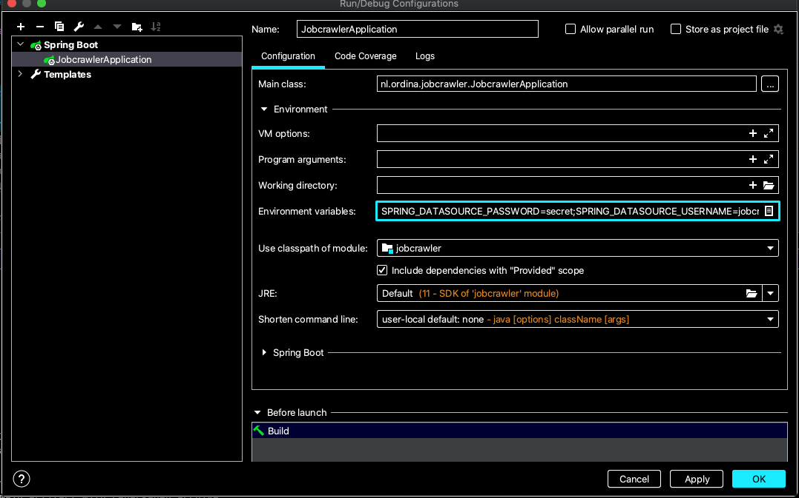

# Jobcrawler smoketest
Smoketest for both front end and backend for the JobCrawler application

### Settings for JDK 
Install JDK 11.0.6 (for example, the Oracle version, openJDK should also work).

In project settings: project SDK is 11, Project name is jobcrawler, project language level is 11 - local variable syntax for lambda parameters
Ditto (11 - local variable syntax for lambda parameters) for project modules

Install lombok plugin into the IDE

### Test Backend run 1. Run from IntelliJ, separate Postgres docker file
Test whether the application runs and is visible from the browser. Postgres is present in a separate docker container that must be run.

### Create and run the container and create a database in it:
#### 1. Run the container and start a shell

```shell script
docker run \
--name jobcrawler-postgres \
-e POSTGRES_PASSWORD=*password* \
-d -p 5432:5432 postgres 
```

```shell script
docker exec -it jobcrawler-postgres bash
```
#### 2. Create database jobcrawler
While in the container shell:

```shell script
psql -U postgres

CREATE USER jobcrawler WITH PASSWORD 'changeme';
CREATE DATABASE "jobcrawler";
GRANT ALL PRIVILEGES ON DATABASE "jobcrawler" TO jobcrawler;
```
Exit from this database and the container by typing `exit` two times.

#### 2. Start scraping

* Run the application from IntelliJ
* What do I see: the application boots without problems but doesn't start scraping
* Edit the ScraperService.java and uncomment line @PostConstruct before the scrape() method. Run the application again.
* What do I see: application starts and starts scraping

Enter the docker container:  
`docker exec -it jobcrawler-postgres bash`

Log in to Postgres:   
`psql -U postgres`

Connect to the jobcrawler database:    
`\c jobcrawler`

Perform the query to find the vacancies:   
`select title from vacancy;`

What do I see: I should now see a number of vacancies

### Start frontend

#### 1. Start frontend in IntelliJ and in the browser

Open the frontend in IntelliJ

Install required dependencies with the command: npm install

Start the frontend with: npm start

What do I see: the application compiles successfully

When I click in the browser on http://localhost:4200

What do I see: a list of vacancies is shown. The filter column is still missing, because the skills are still empty.

#### 2. Add skills via frontend

http://localhost:4200/getskills

What do I see: a page that allows me to add skills.

Add a skill: Java

What do I see: Java is added to the skills

What do I see: When I enter the container again and the database the skill is present in the skills table.

### Adding local environment variables
We can override the defaults used in the code eg: 

```
SPRING_DATASOURCE_PASSWORD=changeme
SPRING_DATASOURCE_USERNAME=jobcrawler
DB_HOSTNAME=localhost
``` 
We can add the environment variables in the run configuration:


